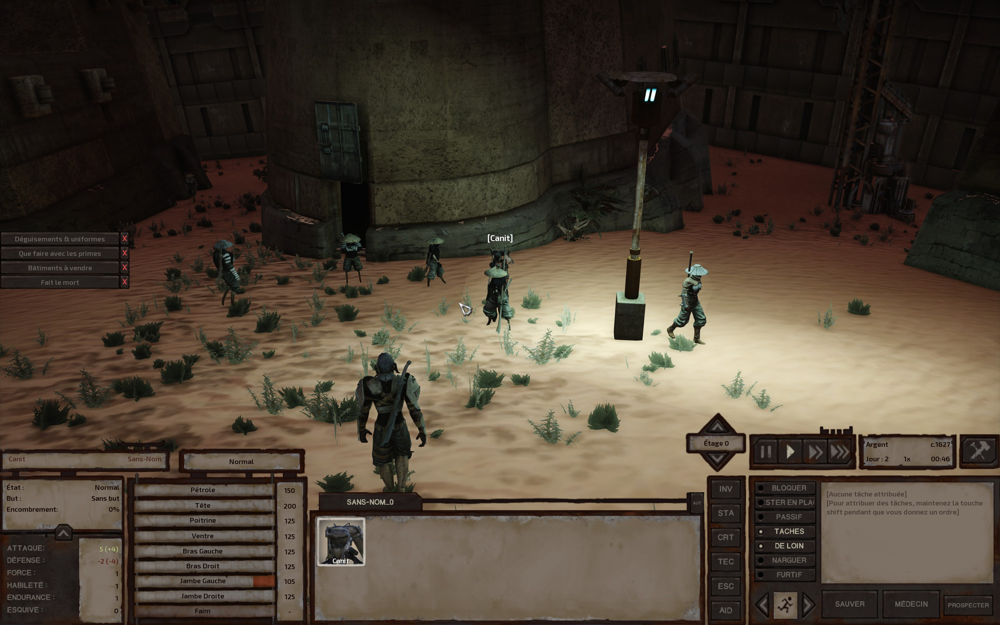
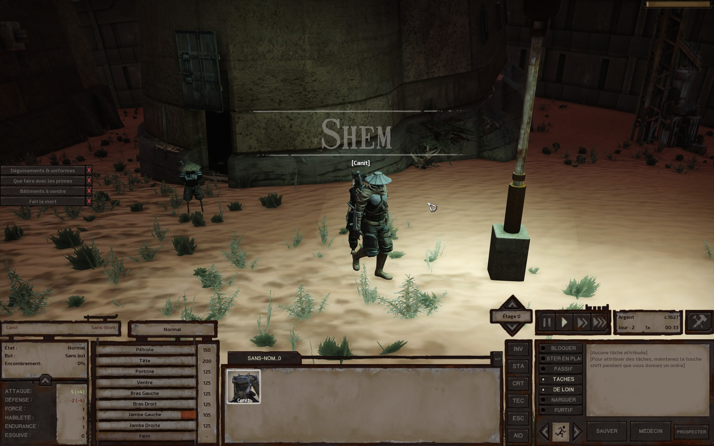
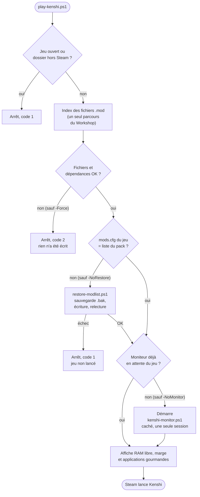
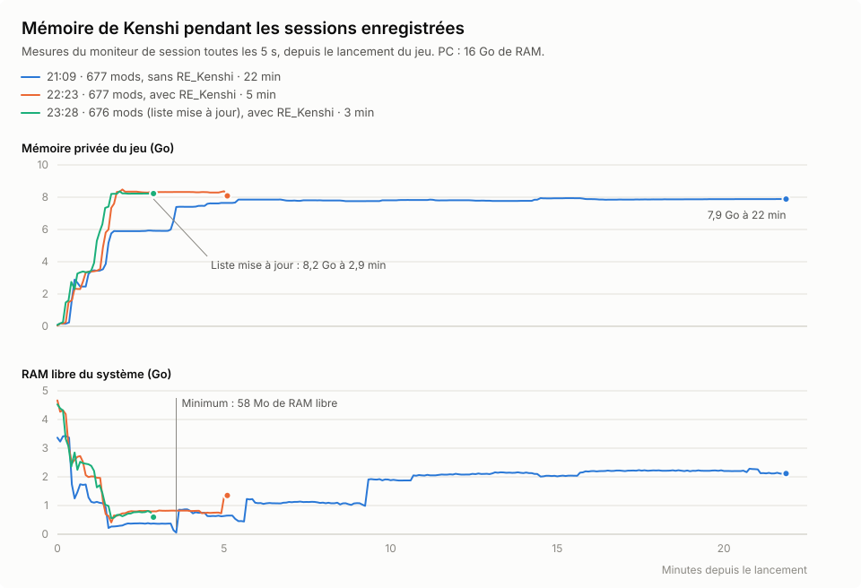

# Kenshi : configuration moddée (pack MEGA Kaizo/UWE+)

Ce dépôt contient ma configuration de mods pour Kenshi, les outils PowerShell pour la remettre en place, la vérifier et lancer le jeu sous surveillance, et le suivi des plantages.

<p>
  
  
</p>

*En jeu : début de partie à Shem, avec les 676 mods du pack et RE_Kenshi.*

## Contenu

| Chemin | Rôle |
|---|---|
| `modlist/mods.cfg` | Ordre de chargement : les **676 mods** du [fil « Load Order »](https://steamcommunity.com/workshop/filedetails/discussion/2822248814/3417684283218879155/) de l'auteur de la collection [MEGA Kaizo/UWE+ Modpack](https://steamcommunity.com/sharedfiles/filedetails/?id=2822248814), dans son ordre : les 675 mods de la collection plus *Beam Thing* ; les 5 mods hors Steam du fil sont exclus. L'ordre de la collection, lui, en diffère sur 14 mods. Vérifié : 0 fichier manquant, 0 dépendance manquante, 0 dépendance chargée trop tard, 0 doublon. |
| `modlist/pack-modlist.csv` | Pour chaque mod : position, ID Workshop, fichier `.mod`, titre, dépendances et lien. Tenu à jour par `tools/update-pack.ps1`. |
| `modlist/extras-400.csv` | Les 400 anciens abonnements hors pack, avec un verdict : 96 « optionnel (ajout pur) », 304 « retirer ». |
| `tools/KenshiTools.psm1` | Module commun à tous les scripts : détection des dossiers Steam, lecture des en-têtes `.mod`, vérification d'une liste, résumé des journaux, plantages, sessions. |
| `tools/health-check.ps1` | Bilan de santé de l'installation (lecture seule) : liste de mods, dépendances, Workshop, GPU, RE_Kenshi, mémoire, disque, plantages récents. |
| `tools/play-kenshi.ps1` | Lance Kenshi proprement : liste du pack remise en place et vérifiée, moniteur armé, puis lancement via Steam. |
| `tools/restore-modlist.ps1` | Remet `modlist/mods.cfg` dans le jeu, après vérification et sauvegarde de l'ancienne liste. |
| `tools/scan-mods.ps1` | Vérifie une liste de mods : fichiers introuvables, en-têtes illisibles, dépendances, ordre, doublons, écart avec le pack. |
| `tools/kenshi-monitor.ps1` | Moniteur de session : mémoire toutes les 5 s, liste de mods au lancement, plantage, journaux et dumps copiés, résumé des erreurs. |
| `tools/summarize-logs.ps1` | Résumé des journaux actuels du jeu (dernière session, mods, erreurs, moteur graphique, plantages), sans passer par le moniteur. |
| `tools/update-pack.ps1` | Compare `modlist/` avec la collection Steam et l'ordre officiel de l'auteur et, sur demande, met à jour `mods.cfg` et `pack-modlist.csv`. |
| `config/` | Copie de `settings.cfg` et `kenshi.cfg`. |
| `reports/` | Plan de tri des mods (`mod-plan.html`), historique et diagnostic des plantages (`crash-history.md`), analyse du pack : conflits, mémoire, réglages, GPU (`pack-analysis.md`), mémoire pendant les sessions enregistrées (`memoire-sessions.svg`, et sa version sombre). |
| `screenshots/` | Captures d'écran en jeu. |
| `logs/sessions/` | Un dossier par session de jeu, créé par le moniteur (résumés uniquement, voir [`logs/README.md`](logs/README.md)). |
| `tests/run-tests.ps1` | Suite de tests automatique du module et de tous les scripts, sur de faux dossiers sous `%TEMP%` (voir « Tester les outils »). |
| `CHANGELOG.md` | Historique des changements, du plus récent au plus ancien. |

## Prérequis

- Windows 11, Kenshi 1.0.68 (Steam, x64).
- Windows PowerShell 5.1 (`powershell.exe`, fourni avec Windows) **ou** PowerShell 7 (`pwsh.exe`). Tous les scripts fonctionnent à l'identique avec les deux.
- Aucun module ni programme à installer : les scripts n'utilisent que PowerShell et .NET.
- Les scripts trouvent Steam tout seuls (registre `HKCU\Software\Valve\Steam`, puis `libraryfolders.vdf` et `appmanifest_233860.acf`). Pour utiliser un autre dossier, passer `-Game <dossier du jeu>` et, pour les scripts qui l'acceptent, `-Workshop <dossier steamapps\workshop\content\233860>`.

Les exemples ci-dessous se lancent depuis le dossier du dépôt. Remplacer `powershell` par `pwsh` pour PowerShell 7. L'aide complète de chaque script est dans son en-tête : `Get-Help .\tools\play-kenshi.ps1 -Full`.

## Déroulement recommandé

```powershell
# 1. Avant de jouer : rien ne bloque ?
powershell -ExecutionPolicy Bypass -File tools\health-check.ps1

# 2. Lancer le jeu : liste du pack restaurée si besoin, vérifiée, moniteur démarré en arrière-plan
powershell -ExecutionPolicy Bypass -File tools\play-kenshi.ps1

# 3. Après la session (attendre environ 1 minute : Windows écrit l'événement de plantage
#    et le dump jusqu'à 46 s après la fermeture) : le résumé des journaux...
powershell -ExecutionPolicy Bypass -File tools\summarize-logs.ps1
# ... et le dossier écrit par le moniteur (summary.json, memory.csv, errors-summary.txt)
Get-ChildItem logs\sessions -Directory | Sort-Object Name | Select-Object -Last 1
```

Au besoin :

```powershell
# Le lanceur de Kenshi a réactivé des mods hors pack (jeu fermé) : remettre la liste du pack
powershell -ExecutionPolicy Bypass -File tools\restore-modlist.ps1

# Détail des problèmes de la liste active (fichiers, dépendances, ordre, doublons)
powershell -ExecutionPolicy Bypass -File tools\scan-mods.ps1

# La collection a changé sur le Workshop ? Rapport, puis mise à jour de modlist\ avec -Apply
powershell -ExecutionPolicy Bypass -File tools\update-pack.ps1
```

**Attention, tant que plus de 1 000 mods sont installés, restaurer la liste ne suffit pas.** Le lanceur de Kenshi oublie les mods qu'il connaît au-delà de 1 001 noms (`data\__mods.list`) et recoche, **à son démarrage**, tous ceux qu'il ne reconnaît plus, puis réécrit `data\mods.cfg` au clic sur Play : les extras reviennent même après `play-kenshi.ps1` ou `restore-modlist.ps1`. Il faut alors les décocher dans l'onglet Mods du lanceur avant de cliquer sur Play, ou repasser sous 1 000 mods installés en se désabonnant des extras dans Steam (la vraie solution). La liste réellement chargée se vérifie après coup : « Mods chargés » dans `summarize-logs.ps1`, ou `mods_loaded` / `mods_at_exit` dans `summary.json`.

## Les outils en détail

Règles communes : messages en français ; `-Game` (et `-Workshop` là où il existe) remplace la détection automatique ; les codes de sortie permettent de les enchaîner. **Aucun script n'arrête Kenshi ou Steam, n'écrit dans les sauvegardes ni dans le dossier Workshop.** Seul `play-kenshi.ps1` lance le jeu.

### `tools/health-check.ps1` : bilan de santé

Imprime un tableau `OK` / `ATTENTION` / `ECHEC` / `MANUEL`, avec un conseil pour chaque point à corriger.

| Contrôle | Ce qui est vérifié |
|---|---|
| Kenshi | `kenshi_x64.exe` en cours d'exécution ou fermé |
| Dossier du jeu, Version | dossier trouvé, `currentVersion.txt` (1.0.68 attendu ; 1.0.65 signalé comme version rétrogradée par RE_Kenshi) |
| Liste de mods | `data\mods.cfg` comparé à `modlist\mods.cfg` : mêmes mods, même ordre |
| Dépendances | fichiers présents, en-têtes lisibles, dépendances activées et dans le bon ordre, doublons sur le disque |
| Workshop | objets installés d'après `appworkshop_233860.acf` : total, hors pack, mods du pack non installés |
| Préférence GPU | exécutable du jeu réglé sur « Hautes performances » (`GpuPreference=2`) dans Windows : processus en cours, sinon `RE_Kenshi\kenshi_x64.exe` si RE_Kenshi est activé et cet exécutable présent, sinon celui à la racine |
| RE_Kenshi | fichier `RE_Kenshi.dll` et entrée active exacte `Plugin=RE_Kenshi` dans `Plugins_x64.cfg` ; journaux ou dossiers seuls signalés comme traces partielles ; copies `*.pre-rekenshi.bak` |
| Smart App Control | désactivé, activé ou en mode évaluation (les fichiers non signés de RE_Kenshi et des mods peuvent être bloqués) |
| Mémoire, Fichier d'échange, Espace disque | RAM installée et libre, fichier d'échange, place sur le lecteur du jeu |
| Plantages 24 h | événements Windows 1000, `crashDump*.zip` du jeu, dumps WER |
| Cartes graphiques | cartes détectées, numéro de pilote GeForce |
| Processeur PhysX | `MANUEL` : le réglage NVIDIA n'est pas lisible de façon fiable, la marche à suivre est indiquée |

- Paramètres : `-Game`, `-Workshop`, `-PackCfg` (par défaut `modlist\mods.cfg` ; `''` pour ne pas comparer ; `pack-modlist.csv` est lu dans le même dossier), `-Json` (contrôles, résumé et code de sortie en JSON).
- Code de sortie : 0 sans `ECHEC`, 1 sinon.
- Ne modifie rien : ni le jeu, ni le Workshop, ni le registre (lu seulement). De `appworkshop_233860.acf`, seuls les IDs des objets installés sont extraits : l'identifiant de compte Steam qui s'y trouve n'est ni extrait, ni affiché, ni conservé.

```powershell
powershell -ExecutionPolicy Bypass -File tools\health-check.ps1
.\tools\health-check.ps1 -Json | ConvertFrom-Json | Select-Object -ExpandProperty Checks
```

### `tools/play-kenshi.ps1` : lancer le jeu proprement



Enchaîne, dans l'ordre :

1. refuse si `kenshi_x64.exe` tourne déjà, ou si `-Game` ou `-Workshop` désigne un autre dossier que ceux de l'installation Steam sans `-DryRun` (Steam lancerait le vrai jeu avec une liste ni restaurée ni vérifiée, ou vérifiée contre un Workshop que le jeu ne lit pas) ;
2. vérifie la liste qui sera chargée (celle du pack si une restauration est prévue) et s'arrête (code 2), **avant toute écriture**, sur fichier `.mod` introuvable ou dépendance absente / non activée / chargée trop tard (sauf `-Force`) ;
3. compare `data\mods.cfg` du jeu avec `modlist\mods.cfg` et, si elle diffère, montre ce qui change (mods hors pack qui seraient désactivés, mods du pack réactivés, 15 premiers listés), la restaure avec `restore-modlist.ps1` (sauf `-NoRestore`), puis relit `data\mods.cfg` pour s'assurer qu'il est bien devenu la liste du pack (sinon code 1, jeu non lancé). Le Workshop n'est parcouru qu'une fois : l'index des fichiers `.mod` construit pour la vérification est passé à `restore-modlist.ps1` ;
4. démarre `kenshi-monitor.ps1 -Once -WaitTimeoutSec 600` dans un PowerShell caché de la même édition que le script (`powershell.exe` ou `pwsh.exe`, jamais l'ISE), avec une transcription dans `logs\sessions\monitor-<date>.log` ; le moniteur se termine de lui-même à la fin de la session, ou après 10 min si le jeu n'apparaît pas (sauf `-NoMonitor`). Si `logs\sessions\monitor.lock` désigne un moniteur qui tourne vraiment (PID, date de création du processus et phase vérifiés) et qui attend encore le jeu avec au moins 2 min devant lui, il est conservé et aucun second n'est démarré ; s'il termine la session précédente (60 s d'attente des rapports Windows après la sortie du jeu) ou arrive au bout de son délai, le script attend qu'il se retire (au plus 150 s) puis en démarre un nouveau ; un verrou périmé (moniteur tué, PID réattribué) est ignoré ;
5. affiche la RAM libre, la marge d'allocation de mémoire (limite d'allocation moins mémoire allouée) et les applications gourmandes ouvertes (navigateurs, VS Code, Discord, pages web de Steam...), avec un avertissement sous 6 Go de RAM libre ou 12 Go de marge ; ne bloque jamais ;
6. lance le jeu via Steam (`steam://rungameid/233860`).

- Paramètres : `-Game`, `-Workshop`, `-DryRun`, `-NoRestore`, `-NoMonitor`, `-Force`.
- `-DryRun` fait toutes les vérifications et affiche chaque action (y compris la ligne de commande exacte du moniteur) sans rien écrire, sans démarrer le moniteur et sans lancer le jeu ; la restauration est simulée avec `restore-modlist.ps1 -WhatIf`. **Avec un faux `-Game` ou un faux `-Workshop`, n'utiliser que `-DryRun`** : le script le refuse sinon.
- Code de sortie : 0 si tout s'est déroulé (ou simulation sans blocage), 1 si refusé (jeu ouvert, `-Game` ou `-Workshop` hors Steam sans `-DryRun`, fichier du dépôt manquant, restauration refusée ou échouée, liste relue différente du pack, pas de liste active avec `-NoRestore`), 2 si bloqué par la vérification.
- C'est le seul script qui lance le jeu, et il le fait uniquement via l'URL Steam, jamais en exécutant `kenshi_x64.exe` directement. Il n'arrête jamais un jeu en cours.
- Le lanceur de Kenshi peut réécrire `data\mods.cfg` au clic sur Play, après la restauration : le script le rappelle à la fin, et la liste effectivement chargée se lit dans `summary.json` (`mods_loaded`, `mods_at_exit`) ou avec `summarize-logs.ps1`.
- Pour arrêter un moniteur caché qui attend encore : `.\tools\kenshi-monitor.ps1 -Stop` (vérifie que le PID du verrou est bien un PowerShell créé à la date enregistrée, l'arrête et supprime `logs\sessions\monitor.lock` ; un verrou périmé est simplement supprimé). Un `Stop-Process` à la main laisse le verrou en place, mais il est alors reconnu périmé.
- La séquence réelle (restauration, moniteur, lancement) n'a encore été exécutée qu'en `-DryRun` : observer la première exécution complète.

```powershell
powershell -ExecutionPolicy Bypass -File tools\play-kenshi.ps1
.\tools\play-kenshi.ps1 -DryRun
.\tools\play-kenshi.ps1 -NoRestore -NoMonitor
```

### `tools/restore-modlist.ps1` : remettre la liste du pack

À lancer jeu fermé. Avant d'écrire : refuse si `kenshi_x64.exe` tourne, si la liste source est vide ou si `<jeu>\data` n'existe pas (`-Game` mal tapé) (code 1), puis vérifie que chaque `.mod` de la liste existe sur le disque (`<jeu>\mods` ou à la racine d'un objet Workshop ; un `.mod` en sous-dossier n'est pas chargé par Kenshi) et s'arrête en listant les absents, 15 premiers (code 1), sauf `-Force`. L'ancien `data\mods.cfg` est copié en `mods.cfg.<AAAAMMJJ-HHmmss>.bak` dans `<jeu>\data` (nom unique, jamais écrasé), puis la liste est écrite en UTF-8 sans BOM, une entrée par ligne, et relue pour vérification. Si la copie ou l'écriture échoue (fichier en lecture seule, par exemple), le script le dit et sort avec le code 1 : il n'annonce jamais une restauration qui n'a pas eu lieu.

- Paramètres : `-Game`, `-Workshop`, `-Source` (liste à restaurer, par défaut `modlist\mods.cfg`), `-Force`, `-WhatIf` (aucune écriture, aucune sauvegarde : affiche seulement ce qui serait remplacé), `-ModIndex` (index des `.mod` déjà construit par `Get-ModFileIndex`, utilisé tel quel au lieu de parcourir le Workshop ; c'est ce que fait `play-kenshi.ps1`).
- Code de sortie : 0 si restauré (ou `-WhatIf` sans blocage), 1 si refusé ou si l'écriture a échoué.
- Seul fichier écrit : `<jeu>\data\mods.cfg` (et sa copie `.bak`). Ne lance pas le jeu.

```powershell
powershell -ExecutionPolicy Bypass -File tools\restore-modlist.ps1
.\tools\restore-modlist.ps1 -WhatIf
```

### `tools/scan-mods.ps1` : vérifier une liste de mods

Pour chaque mod de la liste : le fichier `.mod` doit exister, son en-tête être lisible, et chaque dépendance (lue dans l'en-tête) être présente sur le disque, activée, et chargée avant lui. Signale aussi les mods actifs dont le fichier existe à plusieurs endroits (par exemple `OroborosArmor.mod`, présent dans deux objets Workshop) et, avec une liste de référence, les mods actifs hors pack et les mods du pack non activés. Les fichiers de base du jeu (`gamedata.base`, `Newwworld.mod`, `Dialogue.mod`, `rebirth.mod` et tout `.mod`/`.base` de `<jeu>\data`) comptent comme toujours chargés.

- Paramètres : `-Game`, `-Workshop`, `-ModsCfg` (liste à vérifier, par défaut `data\mods.cfg` du jeu), `-PackCfg` (référence, par défaut `modlist\mods.cfg` ; `''` pour ne pas comparer), `-Json`.
- Un `.mod` présent seulement dans un sous-dossier d'un objet Workshop (deux cas sur ce poste) n'est pas chargé par Kenshi : il compte comme introuvable et est signalé à part, comme dans `update-pack.ps1`.
- Code de sortie : 0 si tout est propre, 2 s'il y a au moins un problème (l'écart avec le pack en est un), 1 si la liste est introuvable.
- Lecture seule.

```powershell
powershell -ExecutionPolicy Bypass -File tools\scan-mods.ps1
.\tools\scan-mods.ps1 -ModsCfg .\modlist\mods.cfg          # la liste du pack elle-même : attendu « OK »
.\tools\scan-mods.ps1 -PackCfg '' -Json                    # dépendances seulement, résultat en JSON
```

### `tools/kenshi-monitor.ps1` : moniteur de session

Attend `kenshi_x64.exe` (sans jamais le lancer), puis, pour chaque session, crée `logs\sessions\<AAAA-MM-JJ_HH-mm-ss>\` et y écrit :

- au lancement : `mods.cfg.at-launch` (copie de la liste active quand `kenshi_x64.exe` apparaît, c'est-à-dire avant que le lanceur ne la réécrive éventuellement) ;
- pendant la partie : `memory.csv`, une ligne toutes les `-IntervalSec` secondes (mémoire du jeu, RAM libre, mémoire allouée du système) ;
- si l'exe lancé par Steam crée `RE_Kenshi\kenshi_x64.exe` puis se ferme, il suit cet enfant dans la même session (`relaunches` dans `summary.json`) : chemin, PID parent et date de création vérifiés, avec au plus 20 s pour le détecter. Un redémarrage normal n'est pas fusionné avec la session précédente ;
- dès la sortie du jeu, avant toute attente (Kenshi écraserait `kenshi_info.log` et `kenshi.log` au lancement suivant) : les journaux `kenshi_info.log`, `kenshi.log`, `save.log`, `settings.cfg`, `RE_Kenshi_log.txt` (s'il existe) et `mods.cfg.at-exit` (la liste telle que le lanceur l'a laissée) ;
- puis, après 60 s d'attente (le temps que Windows écrive l'événement, le dump et le rapport WER) : l'événement Windows 1000 éventuel, rattaché aux processus suivis par leur PID, chemin et date de création lorsqu'elle est disponible (sans PID lisible, par la fenêtre de la session : du lancement à 60 s après la fermeture) ; le gel éventuel (événement 1002 « Application Hang » rattaché de la même façon, ou code de sortie `0xCFFFFFFF` : Windows a fermé le jeu qui ne répondait plus), noté `hung` ; les dumps `kenshi_x64*.dmp` de `%LOCALAPPDATA%\CrashDumps`, le `crashDump*.zip` écrit par Kenshi dans le dossier du jeu et les dossiers de rapport WER `AppCrash_kenshi_x64*` et `AppHang_kenshi_x64*`, tous postérieurs au début de la session ; enfin `summary.json` (avec `mods_loaded`, compté dans `kenshi_info.log`, et `mods_list_rewritten` si la liste a changé entre lancement et sortie, entrée par entrée et dans l'ordre : un réordonnancement compte) et `errors-summary.txt`.

Le contenu exact de chaque fichier, et ce qui est publié ou non, est décrit dans [`logs/README.md`](logs/README.md).

- Paramètres : `-IntervalSec` (5), `-Game`, `-OutDir` (par défaut `logs\sessions` ; à garder sous `logs\` ou hors du dépôt), `-Once` (une seule session, puis fin ; sinon il attend la suivante jusqu'à Ctrl+C), `-WaitTimeoutSec` (0 = attente sans limite ; `play-kenshi.ps1` passe 600), `-Stop` (arrête le moniteur du verrou et supprime le verrou).
- Un seul moniteur à la fois : `<OutDir>\monitor.lock` contient le PID du moniteur en cours, la date de création de son processus, sa phase (`waiting`, `session`, `finishing`) et la fin de son attente ; un second refuse de démarrer (code 1) seulement si ce PID existe encore, est bien un `powershell.exe`/`pwsh.exe` et a été créé à la date enregistrée ; sinon le verrou est périmé (moniteur tué par `Stop-Process`, arrêt de Windows, PID réattribué, date absente ou illisible) et remplacé. Les anciens verrous contenant seulement le PID sont périmés. Le verrou est supprimé à la fin ; `.\tools\kenshi-monitor.ps1 -Stop` arrête un moniteur caché après la même vérification.
- `play-kenshi.ps1` le démarre avec `-Once` dans une fenêtre cachée ; on peut aussi le lancer à la main dans une console et jouer.
- N'écrit que dans le dossier de session (fichiers en UTF-8 sans BOM sous les deux hôtes). Ne lance ni n'arrête rien.

```powershell
powershell -ExecutionPolicy Bypass -File tools\kenshi-monitor.ps1
.\tools\kenshi-monitor.ps1 -Once -IntervalSec 2
```

### `tools/summarize-logs.ps1` : résumer les journaux actuels

Lit les journaux du dossier du jeu, sans le moniteur, et imprime un rapport Markdown :

- dernière session de `save.log` : début (avec la date de `kenshi_info.log`), « Exit. » et durée ou arrêt brutal, sauvegardes, dernière sauvegarde connue toutes sessions confondues ;
- mods chargés d'après `kenshi_info.log`, nombre d'entrées de `data\mods.cfg`, mods chargés hors pack et mods du pack non chargés ;
- erreurs et avertissements, part des « Part map contains invalid colour » (cosmétiques), messages les plus fréquents (nombres remplacés par `#`), mods qui modifient des objets inexistants ;
- moteur graphique (`kenshi.log`) : exceptions OGRE, erreurs de compilation de scripts, avertissements, présence de la séquence « OGRE Shutdown » ;
- plantages depuis le début de la session : événements Windows 1000 (module, code d'exception avec libellé, offset, délai par rapport à « Exit. »), dumps WER, `crashDump*.zip` ;
- une conclusion : signes de plantage ou non.

Kenshi écrase `kenshi_info.log` et `kenshi.log` à chaque lancement, même arrêté au lanceur, alors que `save.log` ne reçoit « Session start. » qu'après le clic sur Play. Les deux fichiers décrivent le même passage si « Session start. » suit « [Launcher] Launching game » de 2 min au plus (le temps passé dans le lanceur avant le clic ne compte pas) ; sinon le rapport le signale (« Passages différents », en disant lequel est le plus récent) et cherche les plantages depuis le plus ancien des deux débuts. Les journaux encore ouverts en écriture par le jeu (session en cours) ou par WER sont lus quand même. Lancé moins d'une minute et demie après la fermeture du jeu, il prévient que l'événement Windows peut encore manquer.

- Paramètres : `-Game`, `-PackCfg` (par défaut `modlist\mods.cfg` ; `''` pour ne pas comparer), `-Top` (lignes par classement, 30), `-OutFile` (écrit aussi le rapport, Markdown UTF-8 sans BOM ; chemin relatif résolu depuis le dossier courant de PowerShell ; le dossier du profil Windows y est masqué en `%USERPROFILE%`), `-SkipWindowsCrashReports` (n'examine ni le journal des événements Windows ni les dumps WER de la machine ; utilisé par les tests sur un faux dossier de jeu).
- Code de sortie : 0 sans signe de plantage, 2 si plantage détecté (événement Windows, dump, `crashDump*.zip` ou session sans « Exit. » alors que le jeu est fermé), 1 si aucun journal n'est trouvé ou si `-OutFile` n'a pas pu être écrit.
- Lecture seule ; n'écrit que le fichier `-OutFile` s'il est demandé.

```powershell
powershell -ExecutionPolicy Bypass -File tools\summarize-logs.ps1
.\tools\summarize-logs.ps1 -Top 10 -OutFile reports\derniere-session.md
```

### `tools/update-pack.ps1` : suivre la collection Steam et l'ordre de l'auteur

Interroge l'API Web publique de Steam (sans clé) pour lire la collection 2822248814, retrouve pour chaque mod le fichier `.mod` téléchargé dans le dossier Workshop, lit ses dépendances dans l'en-tête et compare avec `modlist/pack-modlist.csv` : ajoutés, retirés, déplacés, modifiés (titre, fichier, dépendances), non téléchargés localement, devenus indisponibles sur le Workshop, exclus (aucun fichier `.mod` connu ou seulement en sous-dossier), objets avec plusieurs `.mod`, en-têtes illisibles, éléments non-mods (sous-collections, ignorés).

L'**ordre** vient du premier message du fil [« Load Order »](https://steamcommunity.com/workshop/filedetails/discussion/2822248814/3417684283218879155/), où l'auteur publie le `mods.cfg` à utiliser (plus à jour que l'ordre de la collection, et qui contient *Beam Thing*, absent de la collection). Les mods y sont rangés dans cet ordre ; les mods du fil qui ne sont pas installés (5 mods hors Steam aujourd'hui) sont signalés puis ignorés ; un mod de la collection absent du fil est ajouté à la fin et signalé. Si le fil est illisible, le script s'arrête (code 1) au lieu de revenir en silence à l'ordre de la collection.

- Par défaut, rapport seulement. Avec `-Apply`, réécrit `modlist\mods.cfg` (UTF-8 sans BOM) et `modlist\pack-modlist.csv` (mêmes colonnes) après copie en `.<AAAAMMJJ-HHmmss>.bak`.
- Paramètres : `-CollectionId` (2822248814), `-LoadOrderTopic` (3417684283218879155 ; `''` pour l'ordre de la collection), `-Apply`, `-Workshop`, `-ModlistDir` (par défaut `modlist\` ; utile pour essayer `-Apply` sur une copie).
- Code de sortie : 0 si le pack est à jour (ou vient d'être écrit), 2 si des différences existent sans `-Apply`, 1 en cas d'erreur (réseau, collection, dossier).
- N'écrit que dans le dossier `-ModlistDir` ; le dossier du jeu n'est jamais touché. Un mod nouveau mais pas encore téléchargé n'entre pas dans `mods.cfg` : s'y abonner dans Steam, puis relancer. Le nom précédemment connu d'un objet non téléchargé est conservé ; un objet présent seulement en sous-dossier est exclu, même s'il figurait déjà dans la liste.
- Nécessite une connexion Internet.

```powershell
powershell -ExecutionPolicy Bypass -File tools\update-pack.ps1
.\tools\update-pack.ps1 -Apply
.\tools\update-pack.ps1 -Apply -ModlistDir "$env:TEMP\modlist-test"
```

### `tools/KenshiTools.psm1` : le module commun

Importé par tous les scripts (`Import-Module .\tools\KenshiTools.psm1` pour l'utiliser à la main). Aucune fonction ne lance, n'arrête ni ne touche Steam ou Kenshi ; seules `Write-ModList`, `Backup-File` et `Set-KenshiMonitorLock` écrivent sur le disque, et uniquement au chemin qu'on leur donne.

| Fonction | Rôle |
|---|---|
| `Get-KenshiPaths` | Détecte Steam, la bibliothèque, le jeu, le Workshop, `data\mods.cfg`, les journaux, les sauvegardes, `CrashDumps` et les dossiers de rapport WER |
| `Read-ModHeader` | Lit l'en-tête d'un `.mod` (type, version, auteur, description, dépendances, références), avec bornes vérifiées : un fichier tronqué donne une erreur claire |
| `Get-ModFileIndex` | Indexe les `.mod` de dossiers donnés (`<jeu>\mods`, Workshop), avec tous les emplacements et l'ID Workshop ; rend les doublons visibles |
| `Get-ActiveModList` | Lit un `mods.cfg` (lignes vides ignorées) ; comme toute commande, son résultat est déroulé : l'envelopper dans `@(...)` pour obtenir un tableau même avec 0 ou 1 ligne, ce que font tous les scripts |
| `Test-KenshiModList` | Vérifie une liste : fichiers, en-têtes, dépendances absentes / non activées / trop tard, doublons, écart avec le pack ; retourne les listes, les compteurs et `IsClean` ; toute erreur interne est levée, jamais rendue comme un résultat propre ; `-ModIndex` réutilise un index de `Get-ModFileIndex` au lieu de parcourir le Workshop |
| `Backup-File` | Copie un fichier en `.<AAAAMMJJ-HHmmss>.bak` (compteur si le nom existe déjà) et lève une erreur si la copie échoue |
| `Write-ModList` | Écrit un `mods.cfg` (UTF-8 sans BOM) après copie en `.bak` par `Backup-File`, relit et compare ; lève une erreur si la copie ou l'écriture échoue ; chemin relatif résolu depuis le dossier courant de PowerShell ; supporte `-WhatIf` |
| `Get-KenshiLogSummary` / `Format-KenshiLogSummary` | Résume `kenshi_info.log` (mods chargés, erreurs, messages groupés, mods modifiant des objets inexistants) en données, puis en texte français |
| `Get-KenshiCrashEvents` | Lit les événements Windows 1000 de `kenshi_x64.exe` : module, code d'exception, offset, PID et date de création du processus (`ProcessStartTime`, `null` si absente ou illisible ; propriétés indépendantes de la langue) |
| `Get-KenshiHangEvents` | Lit les événements Windows 1002 « Application Hang » de `kenshi_x64.exe` (gel : Windows a fermé le jeu qui ne répondait plus) : PID, date de création du processus, chemin et ID de rapport, avec les mêmes noms de champs que `Get-KenshiCrashEvents` |
| `Get-KenshiSessions` | Découpe `save.log` en sessions : début, « Exit. », durée, sauvegardes (heures non complétées comme `1:3:52` acceptées) |
| `Open-KenshiLogReader` | Ouvre un journal en lecture avec partage lecture/écriture : lisible même pendant que le jeu ou WER le tient ouvert (`ReadLine()` puis `Dispose()`) |
| `Read-KenshiMonitorLock` / `Set-KenshiMonitorLock` | Lisent et écrivent `monitor.lock` (PID, date de création du processus, phase, fin d'attente) ; `IsLive` n'est vrai que si le PID est encore un PowerShell créé à cette date |

## Tester les outils

`tests/run-tests.ps1` est une suite de tests autonome (ni Pester, ni dépendance) qui construit de faux dossiers sous `%TEMP%` (fichiers `.mod` synthétiques, faux jeu, faux Workshop, faux journaux) et y exerce le module et chaque script, y compris les chemins d'écriture : `restore-modlist.ps1` (restauration, refus, `-Force`, `-WhatIf`, `-ModIndex`, fichier en lecture seule, source vide, `-Game` invalide), `scan-mods.ps1`, `summarize-logs.ps1`, `health-check.ps1`, `kenshi-monitor.ps1 -WaitTimeoutSec` et son verrou (vivant, périmé, `-Stop`), `play-kenshi.ps1` (uniquement en `-DryRun`, restauration simulée comprise, ou pour vérifier qu'il refuse un faux `-Game` ou un faux `-Workshop` sans `-DryRun`) et `update-pack.ps1`. Rien n'est écrit en dehors du dossier temporaire, supprimé à la fin ; Steam et Kenshi ne sont jamais lancés. À lancer avec les deux hôtes :

```powershell
powershell -ExecutionPolicy Bypass -File tests\run-tests.ps1
pwsh -ExecutionPolicy Bypass -File tests\run-tests.ps1
```

- Code de sortie : 0 si tous les tests passent, 1 sinon. `-Filter 'scan-mods*'` ne lance que les tests dont le nom correspond ; `-Keep` conserve le dossier temporaire (chemin affiché).
- Les tests qui exigent que Kenshi soit fermé sont ignorés s'il tourne.
- `tests/health-regressions.ps1`, `tests/pack-regressions.ps1` et `tests/monitor-regressions.ps1`, chargés par le lanceur, simulent le registre, les réponses Steam, les processus et l'horloge pour exercer aussi le GPU de RE_Kenshi, les mises à jour du pack et les redémarrages/plantages successifs. Ces tests n'utilisent pas le réseau.

Vérifications complémentaires à la main, sans effet sur le jeu :

```powershell
# La liste du pack contre les fichiers du disque : attendu « OK : aucun problème détecté. », code 0
.\tools\scan-mods.ps1 -ModsCfg .\modlist\mods.cfg

# Les chemins d'écriture, sans écrire
.\tools\restore-modlist.ps1 -WhatIf
.\tools\play-kenshi.ps1 -DryRun
.\tools\update-pack.ps1          # sans -Apply : rapport seulement
```

Pour exercer un chemin d'écriture pour de bon en dehors de la suite de tests, utiliser un faux dossier de jeu sous `$env:TEMP` passé avec `-Game` (et `-Workshop`) à `restore-modlist.ps1` ou `kenshi-monitor.ps1`, jamais le vrai. **`play-kenshi.ps1` ne doit jamais être lancé sans `-DryRun` avec un faux `-Game` ou un faux `-Workshop`** : Steam lancerait le vrai jeu avec sa liste non restaurée, ou vérifiée contre un Workshop que le jeu ne lit pas (le script refuse les deux).

## Machine

- Intel Core Ultra 7 270HX, **16 Go de RAM** (15,5 utilisables)
- NVIDIA GeForce RTX 5060 Laptop (8 Go), plus le GPU Intel intégré. Kenshi est forcé sur la RTX via les paramètres graphiques de Windows (`health-check.ps1` le vérifie).
- 2560×1600, DirectX 11, **fenêtre sans bordure** ; textures en qualité moyenne, reflets de l'eau à 1
- Kenshi 1.0.68 (Steam, x64), lancé en **1.0.65 par RE_Kenshi v0.3.5**
- Windows : fichier d'échange fixé à 32–48 Go (au lieu de la gestion automatique), mode « Meilleures performances » sur secteur, capture Xbox (GameDVR) coupée, Edge et OneDrive retirés du démarrage, services Dell (SupportAssist, TechHub, etc.) en démarrage manuel
- RAM : 2 × 8 Go DDR5-5600 SO-DIMM, 2 emplacements, jusqu'à 64 Go. Avec RE_Kenshi et le pack, le jeu atteint 8,5 Go de mémoire privée en quelques minutes : passer à 2 × 16 Go est l'amélioration la plus utile.

<picture>
  <source media="(prefers-color-scheme: dark)" srcset="reports/memoire-sessions-sombre.svg">
  
</picture>

Données : `memory.csv` des sessions [21:09](logs/sessions/2026-10-06_21-09-38/memory.csv), [22:23](logs/sessions/2026-10-06_22-23-25/memory.csv) et [23:28](logs/sessions/2026-10-06_23-28-58/memory.csv). Pendant la longue session, la RAM libre remonte vers 2 Go au bout de 10 minutes, à mémoire du jeu constante.

## État connu

Tests avec la liste de l'auteur (677 mods) : sans RE_Kenshi (21:09, 21 min) puis avec (21:44, 17 min). Les deux fois : 677 mods chargés, aucun extra, sauvegardes manuelles et automatiques réussies, aucun plantage en jeu.

- **Plantage en quittant : bug de Kenshi**, avec ou sans mods (même pile d'appels à 0 et à 1 075 mods, et encore au test sans RE_Kenshi), sans correctif connu. Il survient après les sauvegardes, qui restent intactes : toujours sauvegarder avant de quitter. Avec RE_Kenshi, Windows ne l'enregistre plus (ni événement ni dump) : `kenshi.log` se termine sur « something is corrupt in purecall ». Détail dans [`reports/crash-history.md`](reports/crash-history.md).
- **La sauvegarde plantait avec la liste de 1 040 mods** (une référence d'objet cassée dans les marchandises des villes ; source la plus probable, l'extra hors pack 3292696625). Avec la liste de l'auteur, toutes les sauvegardes des deux tests ont abouti.
- **Le lanceur réactive des mods hors pack** quand plus de 1 000 mods sont installés : il oublie les mods qu'il connaît au-delà de 1 001 noms (`data\__mods.list`) et recoche les autres. Contournement en place : `__mods.list` contient les 1 075 noms installés et est **en lecture seule** ; le lanceur n'a plus rien recoché lors des deux tests. Si un nouveau mod est installé, il faudra l'ajouter à ce fichier (ou retirer la lecture seule). Le correctif définitif reste de se désabonner des extras dans Steam (verdicts dans `modlist/extras-400.csv`, sauf *Beam Thing*).
- **Fausse alerte du lanceur** « un ou plusieurs mods ne sont pas dans le bon ordre ou sont manquants » : elle vient des 95 dépendances de *UWE - Items Integration Patch* (l'auteur du pack signale ces fausses alertes). Toutes les dépendances et références des 676 mods sont présentes et dans l'ordre : l'ignorer.
- `data\rebirth.mod` a été modifié volontairement avec le Forgotten Construction Set ; il est gardé tel quel.
- **RE_Kenshi** v0.3.5 (KenshiLib 0.5.0) installé : le jeu tourne en 1.0.65, les plugins des mods se chargent (Dust, KenshiExtensionPlugin, etc. ; aucun échec dans `RE_Kenshi_log.txt`). Une sauvegarde faite en 1.0.68 (`autosave2`) s'est chargée en 1.0.65 et a été resauvegardée sans erreur. Désinstallation : relancer l'installateur, ou remettre `Plugins_x64.cfg.pre-rekenshi.bak` ; `--norekenshi` dans les options de lancement Steam le désactive pour une partie.
- **Smart App Control** est en mode évaluation : s'il passe à « activé », les fichiers non signés (RE_Kenshi, DLL de mods) peuvent être bloqués.
- **Mémoire** : au test sans RE_Kenshi, le jeu a atteint 7,9 Go de mémoire privée et la mémoire allouée du système 22,2 Go ; avec l'ancien fichier d'échange automatique (limite 26,6 Go), la marge aurait probablement manqué. Fermer les autres applications avant de jouer.
- 3 mods de la collection ne sont plus disponibles sur le Workshop (privés ou retirés) mais restent téléchargés localement et donc dans la liste : 1999745738 (`Kenshi Community Loading Screens.mod`, n° 6), 3004525738 (`Extra Node for Flipped Buildings.mod`, n° 294) et 3645025556 (`Deep Foundations for Flipped Buildings.mod`, n° 297). Aucun autre mod du pack n'en dépend. Les deux IDs 2989338777 et 2912426942 liés dans la collection sont des sous-collections (« Kenshi Load Order Organizer - EXTRA », « KLOO One Stop Shop! »), pas des mods : `update-pack.ps1` les ignore.

## Ce qui n'est jamais publié ici

Les dumps de plantage (`.dmp`, `.hdmp`, `.mdmp` et `crashDump*.zip`, qui contiennent un instantané de la mémoire du jeu), les dossiers de rapport Windows (`AppCrash_kenshi_x64*` et `AppHang_kenshi_x64*`, avec `Report.wer`), les sauvegardes, les journaux bruts complets (tout `.log`, plusieurs dizaines de Mo par session ; `save.log` contient en plus des chemins sous `C:\Users\<nom>`), le verrou `monitor.lock`, les copies `.bak` créées par les outils et les identifiants de compte. Ces règles de `.gitignore` (`*.dmp`, `*.log`, `monitor.lock`, `crashDump*.zip`, `AppCrash_*/`, `AppHang_*/`, `*.wer`, `*.bak`) valent où que `kenshi-monitor.ps1 -OutDir` écrive dans le dépôt, pas seulement sous `logs/`.
